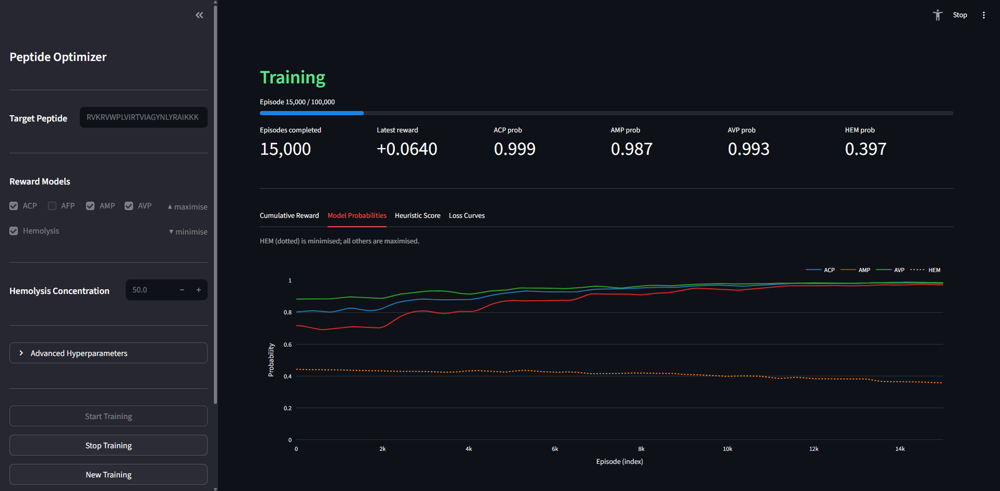

# RL4AXP

A reinforcement learning framework for multi-objective functional peptide (ACP/AFP/AMP/AVP) optimization using Proximal Policy Optimization (PPO).

## Overview

The agent iteratively mutates a seed peptide sequence to maximize therapeutic activity scores (ACP, AFP, AMP, AVP) while minimizing hemolytic toxicity (HEM). A reward engine combining physicochemical design rules and pretrained ML classifiers guides the search.

## Project Structure

```
peptide_optimization/   # PPO agent, environment, reward engine, encoding
amp_prediction/         # Antimicrobial peptide classifier (AI4AMP)
acp_prediction/         # Anticancer peptide classifier (AI4ACP)
afp_prediction/         # Antifungal peptide classifier (ensemble: Doc2Vec + PC6 + BERT)
avp_prediction/         # Antiviral peptide classifier (AI4AVP)
hem_prediction/         # Hemolysis classifier (LysisPeptica / PepBERT)
streamlit_app.py        # Interactive training dashboard
run_train.py            # CLI training entry point
config.py               # Hyperparameters and training settings
```

## Prediction Models

| Module | Method | Target | GitHub |
|--------|--------|--------|--------|
| ACP | AI4ACP (PC6 + CNN) | Anticancer activity | [AI4ACP](https://github.com/yysun0116/AI4ACP) |
| AFP | Ensemble (Doc2Vec + PC6 + ProtBERT) | Antifungal activity | [AI4AFP](https://github.com/lsbnb/AI4AFP) |
| AMP | AI4AMP (PC6 + CNN-LSTM) | Antimicrobial activity | [AI4AMP_predictor](https://github.com/LinTzuTang/AI4AMP_predictor) |
| AVP | AI4AVP (PC6 + CNN) | Antiviral activity | [AI4AVP_predictor](https://github.com/LinTzuTang/AI4AVP_predictor) |
| HEM | LysisPeptica (PepBERT + CNN ensemble) | Hemolysis (minimize) | [LysisPeptica](https://github.com/lsbnbiis/LysisPeptica) |

> **Large model files are excluded from this repo.** Download them and place in the indicated paths before running AFP or HEM inference.
>
> | File | Size | Path | Download |
> |------|------|------|----------|
> | AFP ProtBERT checkpoint | ~1.6 GB | `afp_prediction/ensemble_model/bert/ensemble_prot_bert_bfd_epoch1_1e-06.pt` | [HuggingFace](https://huggingface.co/datasets/wccheng1210/AI4AFP_model/resolve/main/ensemble_model/bert/ensemble_prot_bert_bfd_epoch1_1e-06.pt?download=true) |
> | LysisPeptica HEM model | ~97 MB | `hem_prediction/lysispeptica_models_thr10/p843_750_5041chatt_ugml2std.keras` | [GitHub](https://github.com/lsbnbiis/LysisPeptica/blob/main/models/thr10/p843_750_5041chatt_ugml2std.keras) (open page → click **Raw** to download) |

## Requirements

- Python 3.12.13
- CUDA-capable GPU recommended

```bash
pip install -r requirements.txt
```

## Usage

### Train via CLI

```bash
python run_train.py
```

Configuration is in [config.py](config.py). Logs and checkpoints are saved to `peptide_optimization/logs/`.

### Train via Streamlit Dashboard

```bash
streamlit run streamlit_app.py
```



The dashboard provides a real-time training interface with full control over the optimization run.

#### Sidebar Controls

| Section | Description |
|---------|-------------|
| **Target Peptide** | Seed amino-acid sequence to start optimization from. Must contain only standard amino acids (A–Y). |
| **Reward Models** | Toggle which activity classifiers are active. ACP / AFP / AMP / AVP are maximised; Hemolysis (HEM) is minimised. |
| **Hemolysis Concentration** | Peptide concentration (μg/mL) passed to the HEM predictor. Range: 0.2–250. Default: 50.0. |
| **Advanced Hyperparameters** | Fine-tune N_EPISODES, TIME_HORIZON, ENCODING_SCHEME, AGENTS_LR, AGENTS_LR_STEP_SIZE, AGENTS_LR_GAMMA, N_PARALLELS, and RANDOM_SEED before starting. |

> All sidebar controls are locked once training starts. Use **New Training** to reset.

#### Buttons

| Button | Available when | Action |
|--------|---------------|--------|
| **Start Training** | Idle or Stopped | Starts a new run (Idle) or resumes from the last checkpoint (Stopped). |
| **Stop Training** | Training in progress | Pauses the run; progress is preserved and resumable. |
| **New Training** | Any non-idle state | Resets all progress and re-enables the sidebar. **Note:** unsaved training data will no longer be downloadable from this interface. |

#### Live Charts

- **Cumulative Reward** — smoothed episode reward over time.
- **Model Probabilities** — per-model prediction scores (HEM shown as dotted line).
- **Heuristic Score** — physicochemical rule score of the optimized peptide.
- **Loss Curves** — actor, critic, and entropy losses plus learning rate.

#### Downloads

| Button | Content |
|--------|---------|
| **Download Training Logs** | Full CSV log of every episode (sequence, prediction scores, reward, actions). |
| **Download Top 30 Sequences** | Top 30 unique peptides ranked by combined score (AXP average − HEM probability + heuristic score). |

## Key Hyperparameters (`config.py`)

| Parameter | Default | Description |
|-----------|---------|-------------|
| `TARGET_PEPTIDE` | `RVKRVWPLVIRTVIAGYNLYRAIKKK` | Seed peptide for optimization. The agent starts from this sequence and iteratively mutates it. |
| `N_EPISODES` | `100_000` | Total training episodes. If increased significantly, consider also reducing `AGENTS_LR` and increasing `AGENTS_LR_STEP_SIZE` to allow the learning rate schedule to decay more gradually. |
| `AGENTS_LR` | `2e-5` | Initial learning rate for actor and critic networks. |
| `AGENTS_LR_STEP_SIZE` | `3` | Learning rate is multiplied by `AGENTS_LR_GAMMA` every this many × `CHECKPOINT_INTERVAL` episodes. |
| `AGENTS_LR_GAMMA` | `0.7` | Multiplicative learning rate decay factor applied at each scheduler step. |
| `TIME_HORIZON` | `5` | **Mutation budget per episode.** Each episode allows the agent exactly this many amino-acid substitutions on the seed peptide before the trajectory is collected and the policy is updated. |
| `N_PARALLELS` | `200` | Number of peptide sequences evolved in parallel per episode. Higher values improve sample diversity and GPU utilisation but increase memory usage. |
| `ENCODING_SCHEME` | `PepBERT-large` | Sequence embedding fed to the actor/critic networks. Options: `One-Hot_Encoding` (peptide length × 20, fast, no pretrained weights), `Compressive_Sensing` (random projection of one-hot to dim 32, very fast), `PepBERT-small` (mean-pooled embeddings from a lightweight PepBERT variant), `PepBERT-large` (mean-pooled embeddings from the full PepBERT model, highest expressiveness, recommended). |
| `CHECKPOINT_INTERVAL` | `1000` | Save model weights every this many episodes. |
